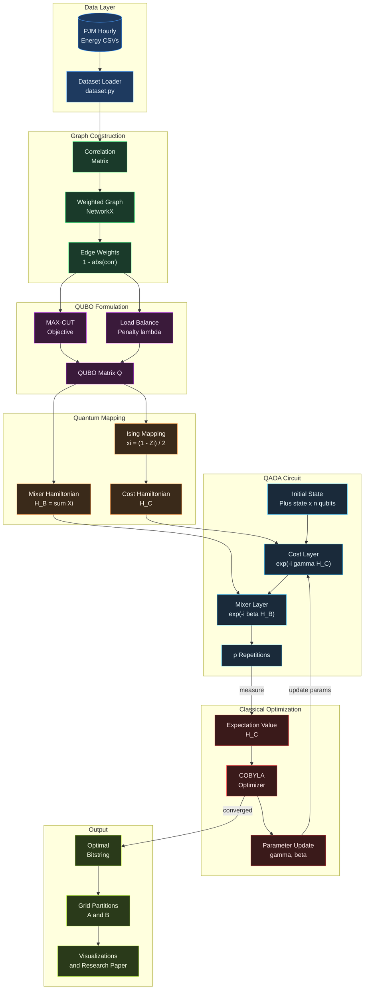
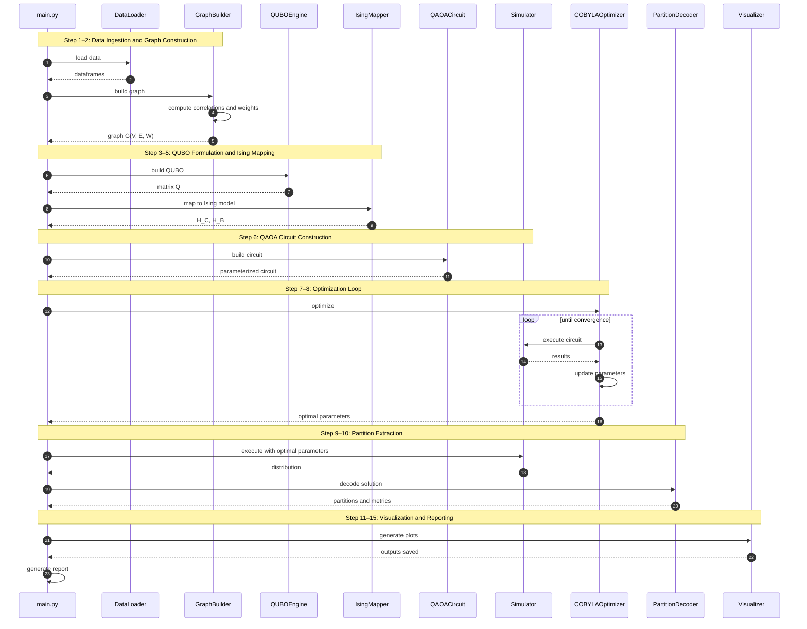
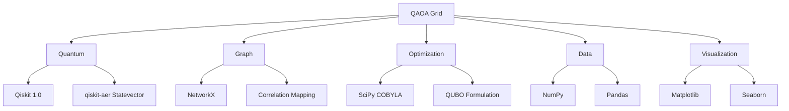

<div align="center">

# ⚡ QAOA-Based Grid Partitioning
### Optimal Power Load Balancing in Smart Grids

<br/>

[](https://www.python.org/)
[](https://qiskit.org/)
[](https://opensource.org/licenses/MIT)
[](https://colab.research.google.com/)

<br/>

> *A hybrid quantum-classical approach to smart grid partitioning using the*
> ***Quantum Approximate Optimization Algorithm (QAOA)***, *formulated as a QUBO*
> *combining MAX-CUT with a load balancing penalty.*

<br/>

</div>

---

## 🌐 Overview

Modern power grids require intelligent partitioning to operate efficiently and resiliently. This project tackles the **NP-hard** problem of grid partitioning using a quantum-native approach — bringing together quantum circuit design, graph theory, and classical optimization into a seamless pipeline.

| Challenge | Solution |
|-----------|----------|
| 🔴 Minimize transmission losses | MAX-CUT objective in QUBO |
| 🟡 Balance electrical load across sub-grids | Load-balancing penalty term |
| 🟢 Enable decentralized fault response | Quantum-optimal binary partitioning |
| ⚫ $2^n$ possible partitions (NP-hard) | QAOA circuit with COBYLA optimizer |

---

## 🏗️ System Architecture



---

## 🔄 End-to-End Workflow



## 🚀 Quick Start

### Local Setup

```bash
# 1. Clone the repository
git clone https://github.com/oyyPoodles/QAOA-Based-Grid-Partitioning-for-Optimal-Power-Load-Balancing-in-Smart-Grids.git
cd QAOA-Based-Grid-Partitioning-for-Optimal-Power-Load-Balancing-in-Smart-Grids

# 2. Install dependencies
pip install -r requirements.txt

# 3. Run the full pipeline
python main.py

```

### ☁️ Google Colab (No Setup Required)

1. Open [`notebooks/QAOA_Smart_Grid.py`](notebooks/QAOA_Smart_Grid.py)
2. Paste the code into a new **[Google Colab Notebook](https://colab.research.google.com/)**
3. Upload the `dataset/` folder to your Colab environment
4. Run all cells sequentially ▶️

---

## 📁 Project Structure

```
📦 QAOA-Grid-Partitioning
├── 🐍 main.py                          ← End-to-end pipeline entry point
├── 📋 requirements.txt
│
├── 📂 dataset/                         ← PJM Hourly Energy CSVs (11 regions)
│   ├── AEP_hourly.csv
│   └── ... (10 more regional files)
│
├── 📂 src/
│   ├── 📂 data/
│   │   └── dataset.py                  ← Steps 1–2 · Graph construction
│   ├── 📂 qaoa/
│   │   ├── hamiltonian.py              ← Steps 3–5 · QUBO & Ising mapping
│   │   ├── circuit.py                  ← Step  6  · QAOA circuit builder
│   │   └── optimizer.py                ← Steps 7–8 · Optimization & extraction
│   ├── 📂 visualization/
│   │   └── plots.py                    ← Steps 11–12 · All visualizations
│   └── 📂 research/
│       └── report.py                   ← Step  15 · Research paper generator
│
├── 📂 notebooks/
│   └── QAOA_Smart_Grid.py              ← Complete Google Colab notebook
│
├── 📂 outputs/                         ← High-resolution generated plots
└── 📂 docs/
    ├── architecture.md
    └── research_paper.md               ← Auto-generated IEEE-style paper
```

---

## 📈 Generated Outputs

After running `python main.py`, the following artifacts are saved to `outputs/`:

| File | Description |
|------|-------------|
| `original_grid.png` | Power grid graph — thicker edges = lower correlation between regions |
| `partitioned_grid.png` | QAOA solution — cut edges highlighted between Partition A and B |
| `load_balance_comparison.png` | Bar chart: random partition vs. QAOA-balanced partition |
| `load_distribution.png` | Mean MW load breakdown per partition |
| `correlation_heatmap.png` | Statistical heatmap of inter-region load similarity |
| `qaoa_convergence.png` | COBYLA optimizer convergence curve across iterations |
| `docs/research_paper.md` | Auto-generated IEEE-style research paper |

---

## 📊 Dataset

**[PJM Interconnection Hourly Energy Consumption](https://www.kaggle.com/datasets/robikscube/hourly-energy-consumption) — Kaggle**

- 🗺️ **11 regional power zones** in the US Eastern Interconnection
- 📅 Hourly MW consumption spanning multiple years
- 🔌 Regions: `AEP` · `COMED` · `DAYTON` · `DEOK` · `DOM` · `DUQ` · `EKPC` · `FE` · `NI` · `PJME` · `PJMW`

---

## 🔬 Technology Stack



---

## 🧪 QUBO Formulation

The optimization problem is cast as a **Quadratic Unconstrained Binary Optimization**:

$$Q = \underbrace{\sum_{(i,j) \in E} w_{ij} \cdot x_i(1 - x_j)}_{\text{MAX-CUT (transmission cost)}} + \underbrace{\lambda \left(\sum_{i} L_i x_i - \frac{L_{total}}{2}\right)^2}_{\text{Load Balance Penalty}}$$

The Ising mapping $x_i = \frac{1 - Z_i}{2}$ converts this to the cost Hamiltonian $H_C$ acting on qubits.

---

## 📚 References

1. Farhi, E., Goldstone, J., & Gutmann, S. (2014). *A Quantum Approximate Optimization Algorithm.* [arXiv:1411.4028](https://arxiv.org/abs/1411.4028)
2. *PJM Hourly Energy Consumption Dataset*, Kaggle — [robikscube/hourly-energy-consumption](https://www.kaggle.com/datasets/robikscube/hourly-energy-consumption)

---

<div align="center">

**[MIT License](LICENSE)** · Made with ⚡ and a few qubits

</div>
