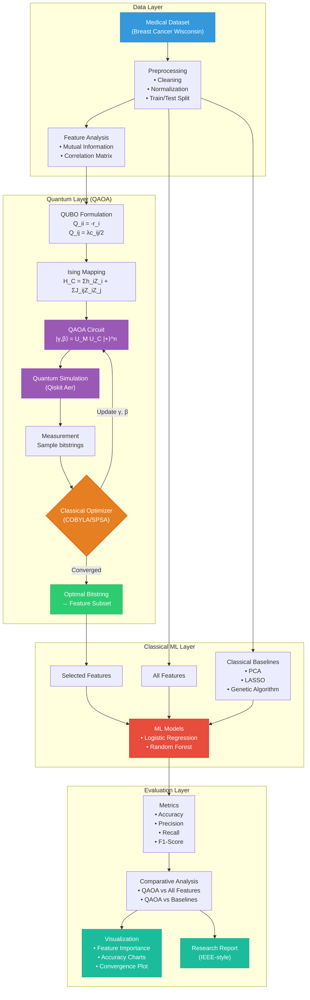
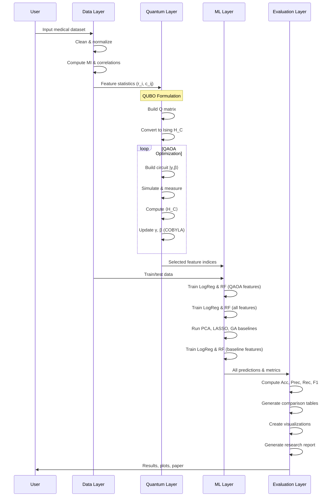

# System Architecture — QAOA Medical Feature Selection

## Steps 13–14: Architecture & End-to-End Workflow

### System Architecture Diagram



### End-to-End Pipeline Flow



### Component Dependency Map

```
main.py
├── src/data/dataset.py          # Data loading & preprocessing
├── src/qaoa/
│   ├── hamiltonian.py           # QUBO & Ising formulation
│   ├── circuit.py               # QAOA circuit construction
│   ├── optimizer.py             # Classical optimization loop
│   └── feature_selector.py      # High-level QAOA selector
├── src/ml/
│   ├── classifier.py            # ML training & evaluation
│   └── baselines.py             # PCA, LASSO, GA
├── src/visualization/plots.py   # All visualizations
└── src/research/report.py       # Research paper generation
```

### Technology Stack

| Layer | Technology | Purpose |
|-------|-----------|---------|
| Quantum Circuit | Qiskit | Build parameterized QAOA ansatz |
| Simulation | Qiskit Aer | Simulate quantum circuits |
| Optimization | SciPy (COBYLA) | Classical parameter optimization |
| Data Processing | NumPy, Pandas, Scikit-learn | Dataset handling |
| Machine Learning | Scikit-learn | Classification models |
| Visualization | Matplotlib, Seaborn | Publication-quality plots |
| Research Output | Markdown / LaTeX | IEEE-style paper generation |
