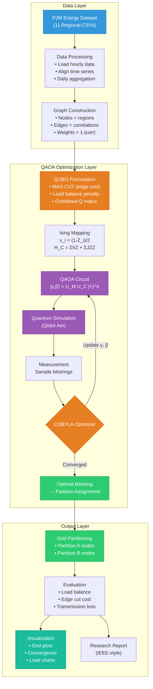
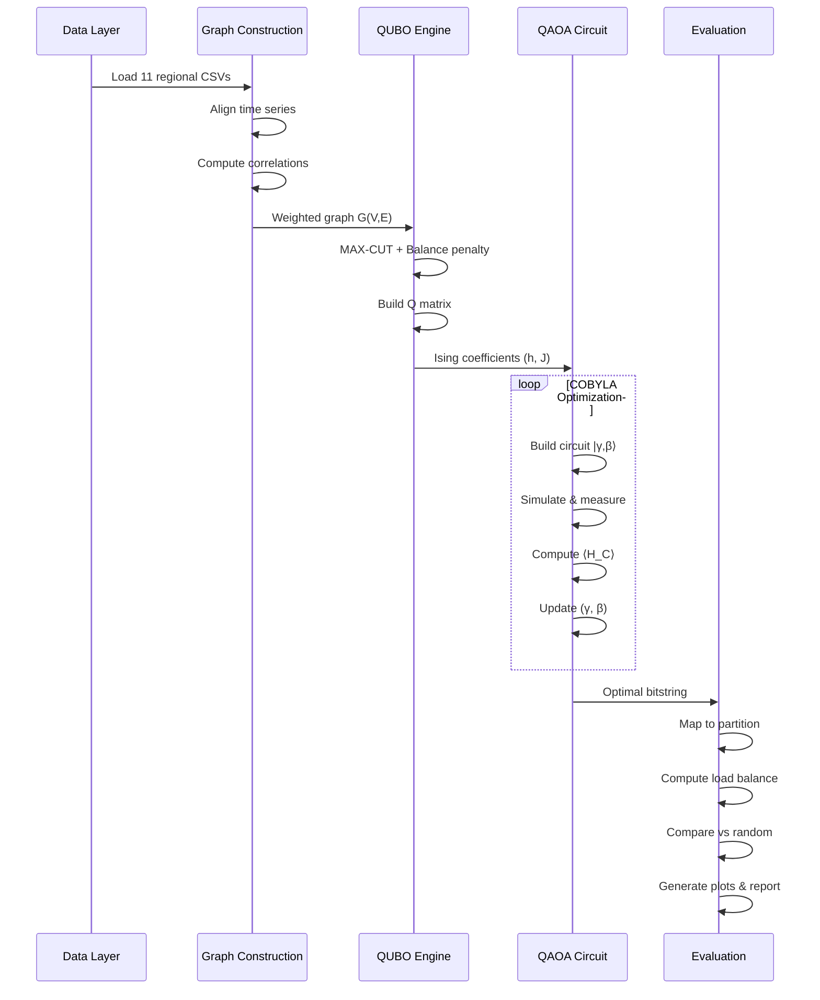

# System Architecture — QAOA Smart Grid Partitioning

## Steps 13–14: Architecture & End-to-End Workflow

### System Architecture Diagram



### End-to-End Pipeline Flow



### Pipeline Summary

```
Dataset (PJM CSVs)
    ↓
Graph Construction (NetworkX)
    ↓
QUBO Formulation (MAX-CUT + Balance)
    ↓
Ising Mapping (x_i → Z_i)
    ↓
QAOA Circuit (Qiskit)
    ↓
Classical Optimization (COBYLA)
    ↓
Optimal Partition
    ↓
Evaluation & Visualization
```
